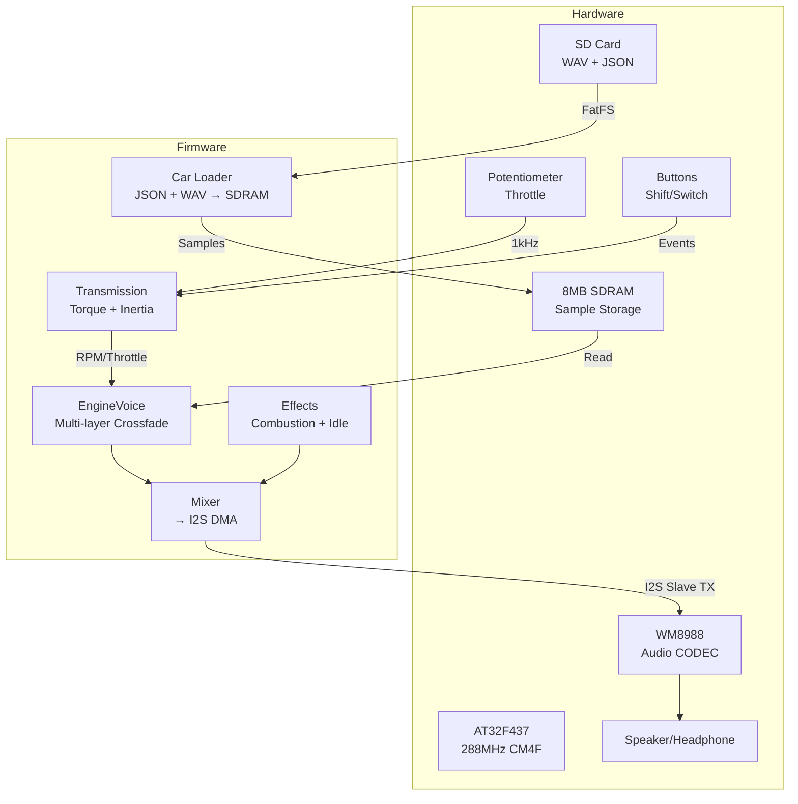
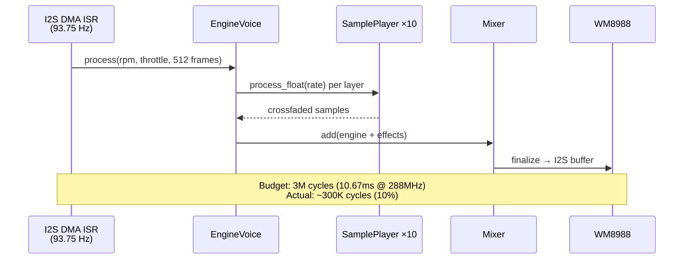

# ExhaustNote 🏎️

[中文文档](README_CN.md)

**Game-quality engine sound simulator running on a microcontroller.**

ExhaustNote synthesizes realistic engine exhaust sounds in real-time using multi-layer crossfade WAV playback, physics-based RPM simulation, and combustion pulse effects — all on an AT32F437 (288MHz Cortex-M4F) with 8MB SDRAM.

## Demo

> Throttle up a Ferrari 458 V8 from idle to 9000 RPM, shift through 7 gears, switch to a Shelby Cobra 427 with one button press.

## Architecture



## Features

| Feature | Description |
|---------|-------------|
| 🎵 Multi-layer crossfade | 5+ WAV layers with trapezoidal envelopes, pitch-shifted playback |
| 🔧 Physics engine | Torque curve, rotational inertia, friction, rev limiter, engine braking |
| 🚗 Multi-car support | Auto-scan SD card, hot-switch between cars |
| 🎛️ Real-time control | Potentiometer throttle, button gear shift, manual transmission |
| 💾 SD card resources | Standard FAT32 SD card with WAV files + JSON config |
| 🖥️ PC Simulator | ImGui desktop app for tuning (same core algorithm) |
| ✅ 71 unit tests | Google Test coverage for all core modules |

## Hardware

| Component | Spec |
|-----------|------|
| MCU | AT32F437VMT7 — 288MHz Cortex-M4F, 4MB Flash, 384KB SRAM |
| Board | AT-SURF-F437 V1.1 |
| Audio | WM8988 CODEC (I2S Slave, 48kHz/16-bit) + TC8002D PA |
| Memory | IS42S16400J 8MB SDRAM (sample storage) |
| Storage | microSD (FAT32, SDIO 4-bit @ 25MHz) |
| Input | 1× potentiometer (throttle), 2× buttons (shift up/down/switch car) |

## Project Structure

```
ExhaustNote/
├── core/                   # Platform-independent engine algorithm
│   ├── include/core/       # Public headers
│   └── src/                # EngineVoice, Transmission, Effects, Mixer
├── app/
│   ├── mcu/                # AT32F437 firmware (main, audio_i2s, sd/car loader)
│   └── sim_gui/            # Desktop simulator (ImGui + SDL2)
├── platform/at32/          # BSP, HAL drivers, FatFS, Arduino Core
├── tests/                  # Google Test unit tests
├── tools/                  # flash.sh, format.sh, generate_demo_cars.py
├── docs/                   # Post-mortems, design notes
└── cars/                   # Car sound packs (shared: sim + SD card)
```

## Quick Start

### Build MCU Firmware

```bash
# Prerequisites: arm-none-eabi-gcc, cmake
cmake -B build/mcu -S app/mcu
cmake --build build/mcu -j$(nproc)

# Flash via ATLink (CMSIS-DAP)
./tools/flash.sh
```

### Build PC Simulator

```bash
# Prerequisites: SDL2, OpenGL, cmake
cmake -B build/sim -S .
cmake --build build/sim --target exhaust_sim_gui -j$(nproc)
./build/sim/app/sim_gui/exhaust_sim_gui
```

### Prepare Sound Resources

ExhaustNote needs WAV audio files for each car. There are two ways to get them:

#### Option A: Generate synthetic demo sounds (no external data needed)

```bash
python3 tools/generate_demo_cars.py
# Creates cars/ with 6 synthetic engine sound packs
# Uses firing-order-based pulse synthesis — no copyright issues
```

#### Option B: Extract from FMOD SoundBank files

Many games and audio tools store sounds in [FMOD](https://www.fmod.com/) `.bank` files (FSB5 container format). If you have legally obtained `.bank` files containing engine sounds, you can extract them:

```bash
pip install fsb5
python3 tools/extract_fmod_bank.py /path/to/bank/files cars/
python3 tools/build_car_configs.py  # Auto-generate car.json for each car
```

> ⚠️ **Copyright Notice**: Extracted audio samples may be copyrighted by their respective owners. Do **NOT** redistribute extracted WAV files from commercial products. The `cars/` directory is gitignored for this reason. These tools are provided for personal/educational use only.

### Prepare SD Card

Format as FAT32, copy `cars/` directory to SD root:
```
SD:/cars/
├── ferrari_458/
│   ├── car.json
│   ├── F4CH_IDLE_EXT.wav
│   ├── ext_on3500.wav
│   └── ...
├── demo_v8_muscle/
│   ├── car.json
│   ├── on_750.wav ... on_6800.wav
│   └── off_750.wav ... off_6800.wav
└── backfire/
    └── backfireEXT_1.wav
```

## Audio Pipeline



## Performance

- **ISR CPU usage**: ~10% (300K / 3M cycles per 512-frame block)
- **Firmware size**: 147KB Flash (3.6% of 4MB)
- **Sample memory**: ~4.3MB SDRAM per car (10 layers × ~430KB each)
- **Latency**: <11ms (one DMA half-buffer)
- **All float arithmetic** — no double (Cortex-M4F hardware FPU)

## car.json Format

```json
{
    "name": "Ferrari 458 Italia",
    "cylinders": 8,
    "rpm_idle": 900,
    "rpm_redline": 9000,
    "peak_torque": 530,
    "peak_torque_rpm": 6000,
    "inertia": 0.12,
    "transmission": {
        "gears": [3.08, 2.19, 1.63, 1.29, 1.03, 0.84, 0.69],
        "final_drive": 4.44
    },
    "onload": [
        {"file": "F4CH_IDLE_EXT.wav", "rpm": 900},
        {"file": "ext_on3500.wav", "rpm": 3500}
    ],
    "offload": [
        {"file": "F4CH_IDLE_EXT.wav", "rpm": 900},
        {"file": "ext_off3000.wav", "rpm": 3000}
    ]
}
```

## License

[MIT](LICENSE)
