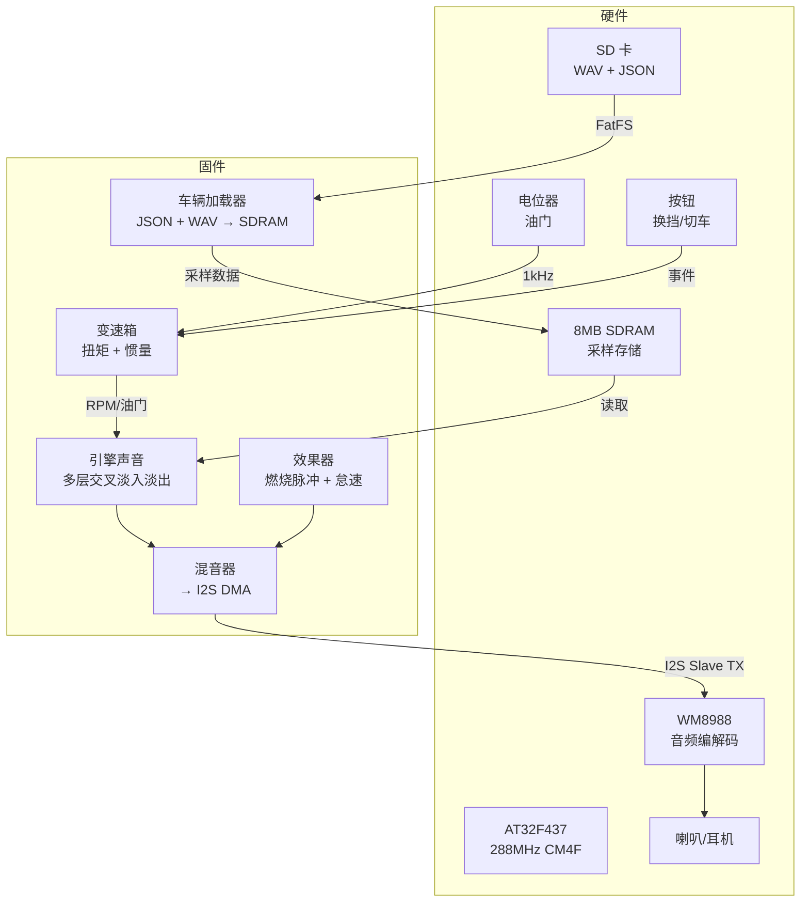
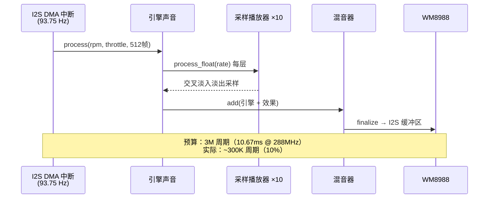

# ExhaustNote 🏎️

[English](README.md)

**在单片机上实现游戏级引擎排气声浪模拟器。**

ExhaustNote 使用多层交叉淡入淡出 WAV 回放、基于物理的转速模拟和燃烧脉冲效果，在 AT32F437（288MHz Cortex-M4F）+ 8MB SDRAM 上实时合成逼真的引擎排气声。

## 演示

> 将法拉利 458 V8 从怠速拉到 9000 RPM，手动换 7 个档位，一键切换到谢尔比眼镜蛇 427。

## 系统架构



## 功能特性

| 功能 | 说明 |
|------|------|
| 🎵 多层交叉淡入淡出 | 5+ WAV 层，梯形包络，变速率音高偏移 |
| 🔧 物理引擎 | 扭矩曲线、转动惯量、摩擦力、断油限速、发动机制动 |
| 🚗 多车支持 | 自动扫描 SD 卡，热切换车辆 |
| 🎛️ 实时控制 | 电位器油门、按钮换挡、手动变速箱 |
| 💾 SD 卡资源 | 标准 FAT32 SD 卡，WAV 文件 + JSON 配置 |
| 🖥️ PC 模拟器 | ImGui 桌面应用，用于调试（相同核心算法） |
| ✅ 71 个单元测试 | Google Test 覆盖所有核心模块 |

## 硬件配置

| 组件 | 规格 |
|------|------|
| MCU | AT32F437VMT7 — 288MHz Cortex-M4F, 4MB Flash, 384KB SRAM |
| 开发板 | AT-SURF-F437 V1.1 |
| 音频 | WM8988 编解码器（I2S Slave, 48kHz/16-bit）+ TC8002D 功放 |
| 内存 | IS42S16400J 8MB SDRAM（采样存储） |
| 存储 | microSD（FAT32, SDIO 4-bit @ 25MHz） |
| 输入 | 1× 电位器（油门）、2× 按钮（升档/降档/切车） |

## 项目结构

```
ExhaustNote/
├── core/                   # 平台无关的引擎算法
│   ├── include/core/       # 公共头文件
│   └── src/                # EngineVoice, Transmission, Effects, Mixer
├── app/
│   ├── mcu/                # AT32F437 固件（main, audio_i2s, sd/car loader）
│   └── sim_gui/            # 桌面模拟器（ImGui + SDL2）
├── platform/at32/          # BSP、HAL 驱动、FatFS、Arduino Core
├── tests/                  # Google Test 单元测试
├── tools/                  # flash.sh, format.sh, ATLink 烧录工具
├── docs/                   # 事后分析、设计笔记
└── sdcard/                 # SD 卡内容（每辆车 WAV + car.json）
```

## 快速开始

### 编译 MCU 固件

```bash
# 依赖：arm-none-eabi-gcc, cmake
cmake -B build/mcu -S app/mcu
cmake --build build/mcu -j$(nproc)

# 通过 ATLink（CMSIS-DAP）烧录
./tools/flash.sh
```

### 编译 PC 模拟器

```bash
# 依赖：SDL2, OpenGL, cmake
cmake -B build/sim -S .
cmake --build build/sim --target exhaust_sim_gui -j$(nproc)
./build/sim/app/sim_gui/exhaust_sim_gui
```

### 准备 SD 卡

格式化为 FAT32，创建目录结构：
```
SD:/ExhaustNote/
├── ferrari_458/
│   ├── car.json
│   ├── F4CH_IDLE_EXT.wav
│   ├── ext_on3500.wav
│   └── ...
├── shelby_cobra_427sc/
│   ├── car.json
│   └── ...
└── backfire/
    └── backfireEXT_*.wav
```

## 音频处理流水线



## 性能指标

- **ISR CPU 占用**：~10%（300K / 3M 周期每 512 帧块）
- **固件大小**：147KB Flash（4MB 的 3.6%）
- **采样内存**：每辆车 ~4.3MB SDRAM（10 层 × ~430KB）
- **延迟**：<11ms（一个 DMA 半缓冲区）
- **全 float 运算** — 无 double（Cortex-M4F 硬件 FPU）

## car.json 格式

```json
{
    "name": "Ferrari 458 Italia",
    "cylinders": 8,
    "rpm_idle": 900,
    "rpm_redline": 9000,
    "peak_torque": 530,
    "peak_torque_rpm": 6000,
    "inertia": 0.12,
    "transmission": {
        "gears": [3.08, 2.19, 1.63, 1.29, 1.03, 0.84, 0.69],
        "final_drive": 4.44
    },
    "onload": [
        {"file": "F4CH_IDLE_EXT.wav", "rpm": 900},
        {"file": "ext_on3500.wav", "rpm": 3500}
    ],
    "offload": [
        {"file": "F4CH_IDLE_EXT.wav", "rpm": 900},
        {"file": "ext_off3000.wav", "rpm": 3000}
    ]
}
```

## 许可证

[MIT](LICENSE)
