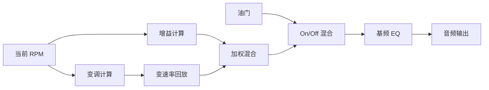
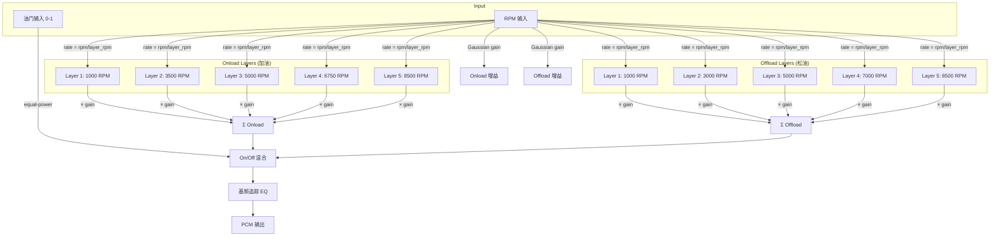
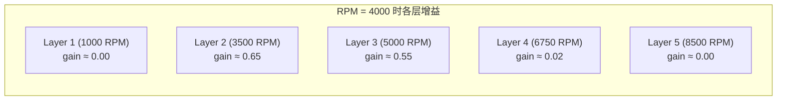
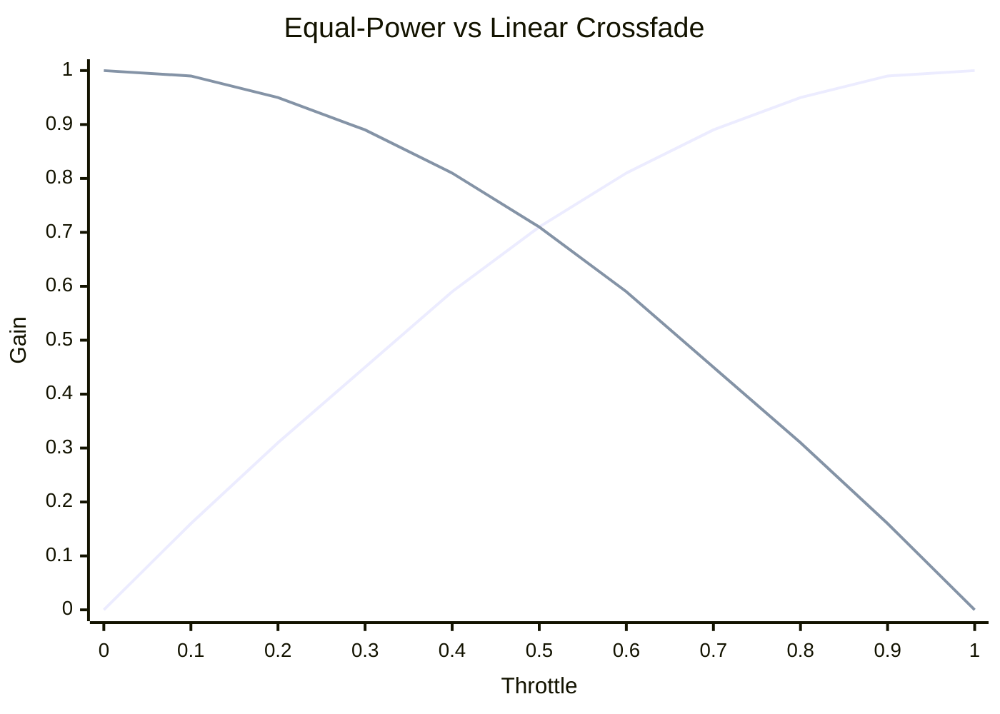
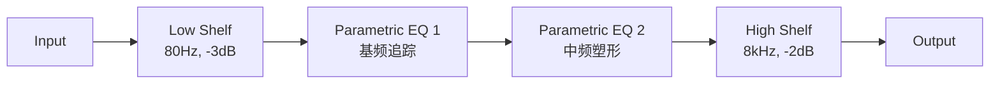

# ExhaustNote 引擎声音合成算法

> 版本: 0.2  
> 日期: 2026-05-30  
> 状态: 实现中

---

## 1. 算法概述

ExhaustNote 采用**多层变速率交叉淡入**（Multi-layer Pitch-shifted Crossfade）算法合成引擎声音。该算法是赛车模拟游戏中广泛使用的工业标准方法，基于公开的音频工程文献和开源游戏引擎实现。

### 1.1 核心思想



**原理**：预录制多个 RPM 点的引擎声音采样（如 1000/3000/5000/7000/9000 RPM），运行时所有层同时回放，每层根据当前 RPM 做变速率播放（变调）并施加增益包络，最终加权混合输出。

---

## 2. 信号流



---

## 3. 变速率回放（Pitch Shifting）

每层采样以可变速率回放，使其音调跟随当前 RPM：

$$
\text{rate}_i = \frac{\text{RPM}_{\text{current}}}{\text{RPM}_{\text{layer}_i}}
$$

- 当 RPM 恰好等于层的录制 RPM 时，`rate = 1.0`（原始音调，最自然）
- 当 RPM 高于录制 RPM 时，`rate > 1.0`（加速回放，音调升高）
- 当 RPM 低于录制 RPM 时，`rate < 1.0`（减速回放，音调降低）

**速率限制**：为避免极端变调导致的失真，限制在 `[0.5, 2.0]` 范围内（±1 个八度）。

### 3.1 相位累加器

```
phase += rate
if phase >= loop_end:
    phase = loop_start + (phase - loop_end)
```

使用双精度浮点相位累加器 + 线性插值，确保亚采样精度：

$$
\text{output}[i] = \text{data}[\lfloor\phi\rfloor] \cdot (1 - f) + \text{data}[\lfloor\phi\rfloor + 1] \cdot f
$$

其中 $f = \phi - \lfloor\phi\rfloor$ 为小数部分。

---

## 4. 增益包络

### 4.1 Gaussian 增益曲线

每层的增益由 Gaussian 函数决定，以该层的录制 RPM 为中心：

$$
g_i = \exp\left(-\frac{1}{2}\left(\frac{\text{RPM} - \text{RPM}_i}{\sigma_i}\right)^2\right)
$$

其中 $\sigma_i$ 为自适应宽度，取相邻层间距的 60%：

$$
\sigma_i = 0.6 \times \min(|\text{RPM}_i - \text{RPM}_{i-1}|, |\text{RPM}_{i+1} - \text{RPM}_i|)
$$

### 4.2 Equal-Power 归一化

为保持总能量恒定，对增益做等功率归一化：

$$
g_i' = \frac{g_i}{\sqrt{\sum_j g_j^2}}
$$

### 4.3 增益平滑

使用指数滤波器平滑增益变化，避免突变产生 click：

$$
g_{\text{smooth}} \mathrel{+}= \alpha \cdot (g_{\text{target}} - g_{\text{smooth}})
$$

$$
\alpha = 1 - e^{-\Delta t / \tau}
$$

默认时间常数 $\tau = 50\text{ms}$。



---

## 5. On/Off Throttle 混合

使用 equal-power（等功率）混合代替线性混合，避免中间位置音量凹陷：

$$
\text{output} = \text{onload} \cdot \sin\left(\frac{\pi}{2} \cdot \text{throttle}\right) + \text{offload} \cdot \cos\left(\frac{\pi}{2} \cdot \text{throttle}\right)
$$



---

## 6. 基频追踪 EQ

引擎的基频（firing frequency）由 RPM 和气缸数决定：

$$
f_0 = \frac{\text{RPM} \times N_{\text{cyl}}}{120} \quad \text{(Hz)}
$$

例如：V8 @ 5000 RPM → $f_0 = 5000 \times 8 / 120 = 333\text{ Hz}$

使用 Peaking EQ 滤波器在基频处施加轻微增强（+2dB, Q=2.0），强化引擎特征音色。

---

## 7. 与传统方法的对比

### 7.1 单层变速率（传统 MCU 方案）


**问题**：高 RPM 时 rate 过大（如 9000/900 = 10x），产生严重的"花栗鼠效应"。

### 7.2 多层硬切换


**问题**：层切换时音色突变，听起来像"换台"。

### 7.3 本项目方法（多层变速率 + Gaussian 混合）


**优势**：
- 主力层始终在 rate ≈ 1.0 附近（最自然）
- 相邻层提供平滑过渡（无突变）
- 远离当前 RPM 的层增益接近 0（不浪费算力）

---

## 8. 行业参考

以下信息来源于公开的游戏开发文献、GDC 演讲、开源引擎和 modding 文档：

### 8.1 通用架构模式

现代赛车游戏的引擎声音系统普遍采用以下架构：

1. **参数驱动**：游戏逻辑计算归一化 RPM（0-1），传入音频引擎
2. **多层采样**：每辆车 5-12 个 RPM 采样层 × 2 个负载状态（on/off throttle）
3. **自动化曲线**：音频中间件（如 FMOD/Wwise）内部的自动化曲线控制每层的音量和音调
4. **实时 DSP**：多段 EQ、距离衰减、多普勒效应、混响

### 8.2 公开的技术资料

| 来源 | 内容 |
|------|------|
| GDC 2014 "The Sound of Grand Theft Auto V" | 多层引擎声音架构概述 |
| FMOD Studio 官方文档 | 参数化音频事件、自动化曲线 |
| Wwise 官方文档 | Blend Container、RTPC 曲线 |
| 开源引擎 (Godot/Bevy) | 变速率回放 + 交叉淡入实现 |
| Andy Farnell "Designing Sound" | 程序化引擎声音合成理论 |

### 8.3 开源游戏引擎中的实现模式

基于公开源码的开源游戏引擎，引擎声音的标准实现模式为：

```
对于每个声音层:
    volume = 梯形包络(rpm, blendInStart, blendInEnd, blendOutStart, blendOutEnd)
    pitch = lerp(minPitch, maxPitch, normalize(rpm, pitchStart, pitchEnd))
    播放采样(volume, pitch)
```

这种"梯形音量 + 线性变调"模式是游戏音频行业的事实标准。

---

## 9. 未来改进方向

### 9.1 梯形包络（替代 Gaussian）

梯形包络允许更精确地控制每层的有效范围：

```
Volume
  1 |    ___________
    |   /           \
    |  /             \
    | /               \
  0 |/                 \
    +---+---+---+---+---→ RPM
     In  Hold    Out
```

每层参数：`blendInStart`, `blendInEnd`, `blendOutStart`, `blendOutEnd`

### 9.2 每层独立变调范围

替代统一的 `rate = rpm / layer_rpm`，允许每层定义自己的变调范围：

```toml
[[layers]]
rpm = 5000
min_pitch = 0.7   # 最低回放速率
max_pitch = 1.4   # 最高回放速率
pitch_start = 3000  # 变调起始 RPM
pitch_end = 7000    # 变调结束 RPM
```

### 9.3 多段 EQ



### 9.4 消音/距离效果

- `muffling` 参数（0-1）：控制低通滤波器截止频率
- 用于模拟车内/车外、距离衰减

---

## 10. MCU 实现考量

### 10.1 计算复杂度

| 操作 | 每帧计算量 (512 samples) |
|------|--------------------------|
| 5 层变速率回放 | 5 × 512 = 2560 次插值 |
| 5 层增益乘法 | 5 × 512 = 2560 次乘法 |
| 增益计算 (Gaussian) | 5 次 exp() |
| EQ (biquad) | 512 × 5 = 2560 次 MAC |
| **总计** | ~10K 次浮点运算/帧 |

在 288MHz Cortex-M4F 上：~10K / 288M ≈ 0.035ms/帧，远低于帧周期 11.6ms。

### 10.2 内存占用

| 资源 | 大小 |
|------|------|
| 5 层 onload × 5s × 44.1kHz × 16bit | 2.2 MB |
| 5 层 offload × 5s × 44.1kHz × 16bit | 2.2 MB |
| 工作缓冲区 | ~8 KB |
| **总计** | ~4.5 MB (PSRAM) |

完全在 8MB PSRAM 预算内。
