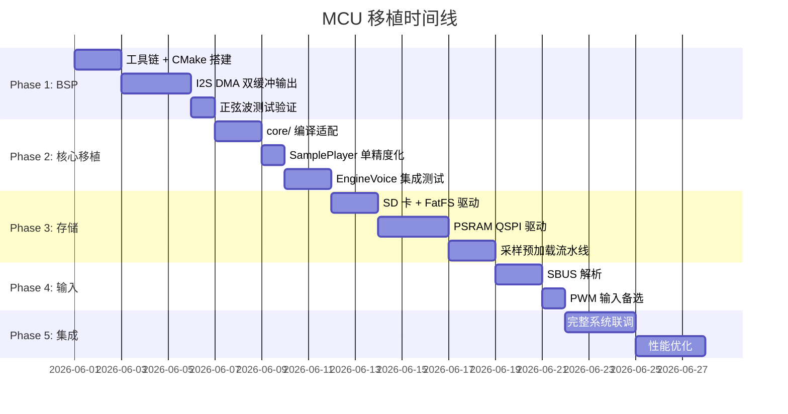
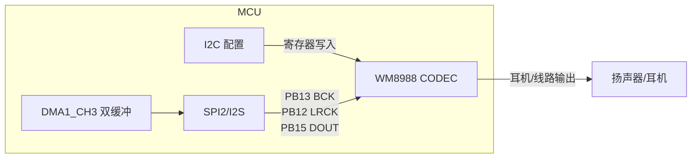
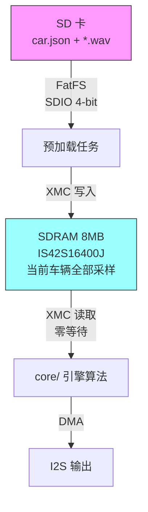
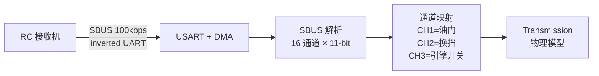
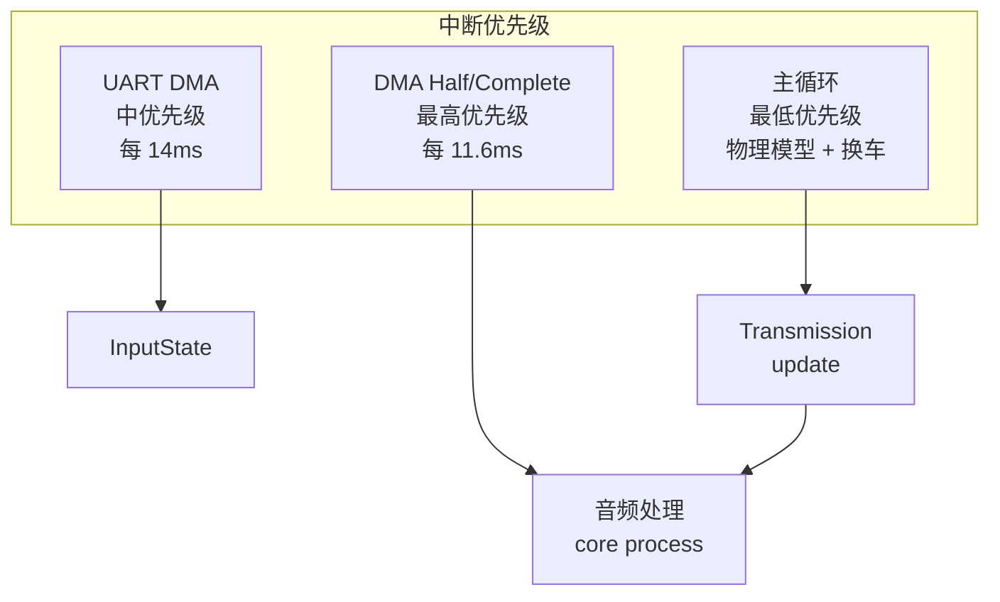
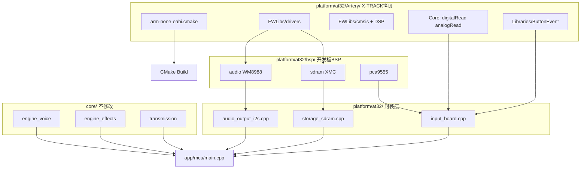

# MCU 移植实施计划

> 目标: 将 ExhaustNote 核心算法移植到 AT32F435/437 MCU  
> 日期: 2026-05-30  
> 状态: 规划阶段

---

## 1. 现状分析

### 1.1 已有资源

```mermaid
graph TB
    subgraph "ExhaustNote 项目"
        CORE[core/<br>平台无关算法<br>C++17, 纯计算]
        SIM[platform/sim/<br>SDL2 桌面实现]
        IFACE[platform/include/<br>IAudioOutput, IInput]
    end

    subgraph "基础开发库 (X-TRACK Vendor/Artery)"
        XTRACK_PLAT[Platform/AT32F43x/<br>CMakeLists.txt 497行<br>完整构建系统]
        TOOLCHAIN[arm-none-eabi.cmake<br>工具链文件]
        FWLIBS[FWLibs/<br>AT32 HAL + CMSIS + DSP]
        CORE_HAL[Core/<br>gpio/timer/spi/delay/pwm<br>Arduino 抽象层]
        ARDUINO[ArduinoAPI/<br>Wire/SPI/Serial/Print]
        STARTUP_LD[startup + linker scripts<br>GCC 启动文件]
        FLASH_TOOL[Tools/<br>flash.sh + OpenOCD]
    end

    subgraph "AT32 开发板资料 (platform/at32/)"
        SDRAM_DRV[at_surf_f437_board_sdram.c/h<br>XMC SDRAM 驱动]
        SDIO_DRV[at32_sdio.c/h<br>SD 卡 SDIO 驱动]
        FATFS_EX[sdio_fatfs example<br>FatFS 集成]
        PCA9555[pca9555 驱动<br>IO 扩展]
        AUDIO_EX[audio example<br>I2S + SD + 解码器]
        PIN_REF[引脚参考<br>开发板原理图]
    end

    CORE --> |移植| MCU_APP[app/mcu/main.cpp]
    IFACE --> |实现| MCU_PLAT[platform/mcu/]
    XTRACK_PLAT --> |基础构建| BUILD[CMake 构建系统]
    FWLIBS --> |HAL 驱动| MCU_PLAT
    CORE_HAL --> |底层抽象| MCU_PLAT
    SDRAM_DRV --> |采样存储| MCU_PLAT
    SDIO_DRV --> |SD 读取| MCU_PLAT
    AUDIO_EX --> |I2S 参考| MCU_PLAT
    TOOLCHAIN --> BUILD
```



### 1.2 核心算法 MCU 兼容性评估

| 模块 | 文件 | MCU 兼容性 | 需要修改 |
|------|------|-----------|---------|
| `crossfade.cpp` | 纯浮点运算 | ✅ Cortex-M4F FPU | 无 |
| `sample_player.cpp` | 双精度相位累加 | ⚠️ 改为单精度 | `double` → `float` |
| `dsp.cpp` | biquad 滤波 | ✅ FPU 加速 | 无 |
| `mixer.cpp` | 浮点混音 + tanh | ⚠️ tanh 较慢 | 用查表或近似 |
| `engine_voice.cpp` | 多层混合 | ✅ | 无 |
| `engine_effects.cpp` | 脉冲/波动/限制器 | ✅ | 无 |
| `transmission.cpp` | 物理模型 | ✅ | 无 |
| `car_config.cpp` | cJSON + 文件 I/O | ⚠️ 需要 SD 卡 | 适配 FatFS |

### 1.3 硬件目标（AT-SURF-F437 开发板）

| 组件 | 型号 | 接口 | 引脚 |
|------|------|------|------|
| MCU | AT32F437VMT7 | 288MHz Cortex-M4F, 4MB Flash, 384KB SRAM | — |
| SDRAM | IS42S16400J (8MB) | XMC 16-bit | PD/PE/PF/PG (多引脚) |
| 音频 CODEC | **WM8988** | I2S (SPI2) + I2C 控制 | 见下表 |
| SD 卡 | Micro SD | SDIO 4-bit | 开发板已有驱动 |
| IO 扩展 | PCA9555 | I2C | Joystick 五向键 |
| 电位器 | 板载可变电阻 | ADC1 CH5 | **PA5** |
| 按键 | KEY_1 / KEY_2 | GPIO | **PA0** / **PC13** |
| Joystick | 五向 (PCA9555) | I2C → PCA IO1 | 上/下/左/右/确认 |

#### 音频 I2S 引脚 (SPI2)

| 信号 | 引脚 | GPIO MUX |
|------|------|----------|
| I2S_CK (BCLK) | PB13 | AF5 |
| I2S_WS (LRCK) | PB12 | AF5 |
| I2S_SD_OUT (DOUT) | PB15 | AF5 |
| I2S_SD_IN (DIN) | PB14 | AF6 |
| DMA | DMA1_CH3 | DMAMUX_CH3 |

#### 输入设备映射（用于模拟器控制）

| 功能 | 硬件 | 引脚/接口 | API | 用途 |
|------|------|-----------|-----|------|
| 油门 | 电位器 (ADC) | PA5 (ADC1_CH5) | `analogRead(PA5)` | 0-4095 → 0-100% |
| 升档 | KEY_1 | PA0 (GPIO) | `ButtonEvent` | 短按=升档 |
| 降档 | KEY_2 | PC13 (GPIO) | `ButtonEvent` | 短按=降档 |
| 引擎开关 | Joystick ENTER | PCA9555 IO1_3 | `ButtonEvent` | 短按=开关引擎 |
| 切换车辆 | Joystick LEFT/RIGHT | PCA9555 IO1_4/1 | `ButtonEvent` | 短按=上/下一辆 |

**输入代码示例** (使用 X-TRACK Arduino API):
```cpp
#include "Arduino.h"      // pinMode, analogRead, digitalRead
#include "ButtonEvent.h"  // 按键事件 (短按/长按/双击)

// 油门: 直接 ADC 读取
float throttle = analogRead(PA5) / 4095.0f;

// 按键: ButtonEvent 处理消抖和事件
ButtonEvent btn_shift_up;
btn_shift_up.bindPin(PA0, INPUT_PULLDOWN);
btn_shift_up.onPress([]{ transmission.shift_up(); });
```

> **注**: WM8988 是完整的音频 CODEC（含 DAC + ADC + 耳放），通过 I2C 配置寄存器，通过 I2S 传输音频数据。PCA9555 是 I2C IO 扩展器，用于读取 joystick 按键状态和控制 WM8988 使能。

### 1.4 开发基础架构

**使用 X-TRACK 项目的 Vendor/Artery 作为基础库**，包含：

| 层级 | 来源 | 内容 |
|------|------|------|
| 启动/链接 | X-TRACK `FWLibs/cmsis/` | `startup_at32f435_437.s` + `AT32F437xM_FLASH.ld` |
| HAL 驱动 | X-TRACK `FWLibs/drivers/` | 28 个外设驱动 (I2S, DMA, GPIO, XMC...) |
| CMSIS-DSP | X-TRACK `FWLibs/cmsis/dsp/` | arm_math.h, FFT, 滤波器加速 |
| 硬件抽象 | X-TRACK `Core/` | gpio, timer, delay, SPI, UART 封装 |
| Arduino API | X-TRACK `ArduinoAPI/` | Wire, Serial, Print 兼容层 |
| 工具链 | X-TRACK `arm-none-eabi.cmake` | GCC 交叉编译配置 |
| 烧录 | X-TRACK `Tools/` | OpenOCD + AT-Link |

**从 AT32 开发板资料整体复制 BSP 目录** (`at_surf_f437_board/`)：

策略：整个目录复制到 `platform/mcu/bsp/`，CMake 中按需选择编译的文件。
驱动之间有依赖关系（audio→pca9555→i2c），不宜拆散。

| 驱动 | 文件 | 用途 | 编译 |
|------|------|------|------|
| Audio | `*_audio.c/h` | WM8988 I2S + I2C 初始化 | ✅ 必须 |
| SDRAM | `*_sdram.c/h` | XMC SDRAM 初始化 + 读写 | ✅ 必须 |
| PCA9555 | `*_pca9555.c/h` | I2C IO 扩展（audio/joystick 依赖） | ✅ 必须 |
| Key | `*_key.c/h` | 按键 GPIO (PA0/PC13) | ✅ 需要 |
| Joystick | `*_joystick.c/h` | 五向键 (PCA9555) | ✅ 需要 |
| Variable Resistor | `*_variable_resistor.c/h` | ADC 电位器 (PA5) | ✅ 需要 |
| Player | `*_player*.c/h` | WAV/MP3/FLAC 播放器 | ⚠️ 参考 |
| Delay | `*_delay.c/h` | 延时函数 | ✅ 需要 |
| LCD | `*_lcd.c/h` | LCD 显示 | ❌ 不编译 |
| Touch | `*_touch.c/h` | 触摸屏 | ❌ 不编译 |
| Camera/DVP | `*_camera/dvp*` | 摄像头 | ❌ 不编译 |

另外从 `examples/sdio/sdio_fatfs/` 复制 SDIO + FatFS 集成代码。

---

## 2. 实施计划

### 2.1 阶段划分



### 2.2 Phase 1: BSP 搭建（I2S 音频输出）

**目标**: 能从 MCU 输出正弦波到 WM8988 CODEC



**WM8988 初始化流程** (参考 `at_surf_f437_board_audio.c`):
1. PCA9555 使能 WM8988 电源
2. I2C 写入 WM8988 寄存器（采样率、DAC 使能、音量）
3. 配置 SPI2 为 I2S Master 模式（16-bit, 44.1kHz）
4. 启动 DMA1_CH3 双缓冲传输

**关键文件**:
- `platform/mcu/CMakeLists.txt` — 交叉编译配置
- `platform/mcu/audio_output_i2s.cpp` — I2S DMA + WM8988 初始化
- `platform/mcu/board_drivers/` — 从开发板资料复制的驱动
- `app/mcu/main.cpp` — MCU 入口

**参考**:
- X-TRACK 的 `Platform/AT32F43x/CMakeLists.txt` (497行完整构建)
- `at_surf_f437_board_audio.c/h` — WM8988 I2C 配置 + I2S DMA
- `at_surf_f437_board_variable_resistor.c/h` — ADC 电位器读取
- `at_surf_f437_board_key.c/h` — 按键 GPIO 读取

**CMake 构建结构**:
```cmake
# platform/mcu/CMakeLists.txt
set(CMAKE_TOOLCHAIN_FILE ${CMAKE_SOURCE_DIR}/scripts/arm-none-eabi.cmake)

# AT32 HAL sources
set(AT32_SDK ${CMAKE_SOURCE_DIR}/platform/at32/AT32F435_437_Firmware_Library_V2.1.1)
set(AT32_DRIVERS ${AT32_SDK}/libraries/drivers)
set(AT32_CMSIS ${AT32_SDK}/libraries/cmsis/cm4)

add_library(at32_hal STATIC
    ${AT32_CMSIS}/device_support/system_at32f435_437.c
    ${AT32_DRIVERS}/src/at32f435_437_crm.c
    ${AT32_DRIVERS}/src/at32f435_437_gpio.c
    ${AT32_DRIVERS}/src/at32f435_437_i2s.c
    ${AT32_DRIVERS}/src/at32f435_437_dma.c
    ${AT32_DRIVERS}/src/at32f435_437_misc.c
    # ... 按需添加
)
```

### 2.3 Phase 2: 核心算法移植

**目标**: `core/` 库在 MCU 上编译运行，输出引擎声音

**需要的修改**:

| 文件 | 修改 | 原因 |
|------|------|------|
| `sample_player.cpp` | `double phase_` → `float` | 双精度在 M4F 上无 FPU 加速 |
| `mixer.cpp` | `std::tanh` → 快速近似 | 标准库 tanh 太慢 |
| `car_config.cpp` | 条件编译 `#ifdef MCU` | MCU 上用简化的配置加载 |
| `engine_voice.h` | `kDefaultBufferFrames` 可能需要调小 | SRAM 限制 |

**编译标志**:
```cmake
target_compile_definitions(exhaust_core PRIVATE
    $<$<BOOL:${MCU_BUILD}>:EXHAUST_MCU=1>
)
target_compile_options(exhaust_core PRIVATE
    $<$<BOOL:${MCU_BUILD}>:-O2 -ffast-math>
)
```

### 2.4 Phase 3: 存储系统

**目标**: SD 卡读取 WAV → SDRAM 缓存 → 引擎实时读取



**SDRAM 优势 vs PSRAM**:
- XMC 接口：CPU 可直接寻址（映射到 0xC0000000），无需 SPI 命令
- 16-bit 总线宽度：带宽更高
- 零等待状态读取（配合 XMC 时序优化）
- 开发板已有验证过的驱动代码

**内存布局 (SDRAM 8MB @ 0xC0000000)**:
```
0xC0000000 - 0xC02FFFFF  Onload layers (5 × ~600KB = 3MB)
0xC0300000 - 0xC05FFFFF  Offload layers (5 × ~600KB = 3MB)
0xC0600000 - 0xC06FFFFF  Backfire + misc samples (1MB)
0xC0700000 - 0xC07FFFFF  Reserved (1MB)
```

**SRAM 使用 (384KB)**:
```
0x20000000 - 0x2000BFFF  Stack + Heap (48KB)
0x2000C000 - 0x2000FFFF  I2S DMA 双缓冲 (2 × 2KB = 4KB + padding)
0x20010000 - 0x20013FFF  core/ 工作缓冲区 (16KB)
0x20014000 - 0x2005FFFF  应用 + FatFS + cJSON + 其他 (304KB)
```

### 2.5 Phase 4: RC 输入

**目标**: 解析 SBUS/PWM 信号，映射到油门/换挡



### 2.6 Phase 5: 系统集成



---

## 3. 文件结构规划

```
platform/at32/
├── CMakeLists.txt              ← MCU 平台构建
├── at32f435_437_conf.h         ← 外设配置 (启用 I2S/DMA/XMC/SDIO/ADC)
├── audio_output_i2s.cpp        ← IAudioOutput 实现 (封装 BSP audio)
├── storage_sdram.cpp           ← 采样存储 (封装 BSP sdram)
├── input_board.cpp             ← IInput 实现 (analogRead + ButtonEvent)
├── sdcard_fatfs.cpp            ← SD 卡 + FatFS
│
├── Artery/                     ← 从 X-TRACK 拷贝 (可定制修改)
│   ├── Platform/AT32F43x/
│   │   ├── CMakeLists.txt      ← 主构建文件
│   │   ├── arm-none-eabi.cmake ← 工具链
│   │   ├── Core/               ← gpio/timer/delay + digitalRead/analogRead/pinMode
│   │   └── FWLibs/             ← AT32 HAL + CMSIS + DSP
│   ├── ArduinoAPI/             ← Arduino 兼容层 (Wire/Serial/Print)
│   ├── Libraries/
│   │   └── ButtonEvent/        ← 按键事件库 (长按/短按/双击)
│   └── Tools/                  ← flash.sh + OpenOCD
│
└── bsp/                        ← 整体复制 at_surf_f437_board/ 目录
    ├── at_surf_f437_board_audio.c/h        ← WM8988 + I2S
    ├── at_surf_f437_board_sdram.c/h        ← XMC SDRAM
    ├── at_surf_f437_board_pca9555.c/h      ← IO 扩展
    ├── at_surf_f437_board_player*.c/h      ← 播放器 (参考 DMA 用法)
    ├── at_surf_f437_board_delay.c/h        ← 延时
    └── ...                                 ← LCD/Touch 等不编译

app/mcu/
├── CMakeLists.txt              ← 顶层 MCU 构建
└── main.cpp                    ← MCU 入口

scripts/
├── build_mcu.sh                ← MCU 构建脚本
└── flash.sh                    ← 烧录脚本
```

### 3.1 构建依赖关系



---

## 4. 性能预算

### 4.1 CPU 时间 (每帧 512 samples @ 44.1kHz = 11.6ms)

| 操作 | 估算时间 | 占比 |
|------|---------|------|
| 5 层变速率回放 (PSRAM 读取) | 0.3ms | 2.6% |
| 5 层增益乘法 + 混合 | 0.1ms | 0.9% |
| 梯形包络 + 平滑 | 0.02ms | 0.2% |
| 3 段 biquad EQ | 0.05ms | 0.4% |
| 燃烧脉冲 | 0.02ms | 0.2% |
| On/Off 混合 + 输出 | 0.05ms | 0.4% |
| **总计** | **~0.55ms** | **4.7%** |

**结论**: CPU 占用率 < 5%，有巨大余量。

### 4.2 内存带宽

| 操作 | 带宽需求 |
|------|---------|
| SDRAM 读取 (5 层 × 44.1kHz × 2B) | 441 KB/s |
| I2S 输出 (44.1kHz × 2B) | 88 KB/s |
| SDRAM 可用带宽 (XMC 16-bit @ 144MHz) | ~288 MB/s |
| **利用率** | **~0.2%** |

**SDRAM 优势**: 直接映射到 CPU 地址空间（0xC0000000），读取无需 SPI 命令开销，可像普通内存一样用指针访问。

---

## 5. 风险与缓解

| 风险 | 影响 | 缓解 |
|------|------|------|
| SDRAM 刷新冲突 | 偶发延迟 | I2S DMA 双缓冲隔离，SDRAM 刷新周期远小于音频帧 |
| SD 卡读取慢 | 换车时间长 | SDIO 4-bit 模式 (~10MB/s)，4.5MB 采样 < 1s |
| `double` 精度不足 | 相位漂移 | 用 `uint32_t` 定点相位或保持 `float`（M4F 有 FPU） |
| SBUS 信号丢失 | 失控 | 超时检测 → 怠速保护 |
| Flash 不够 | 代码放不下 | 4MB Flash 绰绰有余 |
| X-TRACK 库版本冲突 | 编译错误 | 锁定 submodule 到特定 commit |
| SDRAM 引脚冲突 | 外设不够用 | 参考开发板原理图确认引脚分配 |

---

## 6. 第一步行动

1. **拷贝 X-TRACK 基础库**: 从 X-TRACK 拷贝 Vendor/Artery 到 `platform/at32/Artery/`（直接拷贝，非 submodule，方便定制）
2. **复制开发板 BSP**: 整体复制 `at_surf_f437_board/` 到 `platform/at32/bsp/`
3. **创建 `app/mcu/CMakeLists.txt`**: 引用 X-TRACK 的 Platform CMake + 添加我们的源文件
4. **实现 `audio_output_i2s.cpp`**: 基于 `at_surf_f437_board_audio.c` 封装 WM8988 + I2S DMA
5. **正弦波测试**: 在 `app/mcu/main.cpp` 中生成 1kHz 正弦波，通过 WM8988 耳机口输出
6. **输入测试**: 读取电位器 (PA5 ADC) 和按键 (PA0/PC13)，串口打印值
7. **验证**: 耳机确认音频输出 + 电位器/按键响应正常

**预计时间**: 2-3 天完成 Phase 1（假设硬件已就绪）

---

## 7. 关键接口适配

### 7.1 SDRAM 作为采样存储

```cpp
// SDRAM 映射地址，可直接用指针访问
#define SDRAM_BASE_ADDR  0xC0000000
#define SDRAM_SIZE       (8 * 1024 * 1024)  // 8MB

// 采样数据直接存放在 SDRAM，EngineVoice 的 LayerConfig.data 指向这里
// 无需任何特殊读取 API —— 就是普通的内存指针
EngineVoice::LayerConfig config;
config.data = reinterpret_cast<const sample_t*>(SDRAM_BASE_ADDR + offset);
config.length = sample_count;
```

### 7.2 I2S DMA 双缓冲

```cpp
// DMA Half-Transfer 和 Transfer-Complete 中断
// 在中断中调用 core/ 的 process() 填充下一半缓冲区
void DMA1_Channel3_IRQHandler() {
    if (half_transfer) {
        engine.process(params, &dma_buffer[0], HALF_BUFFER_SIZE);
    } else if (transfer_complete) {
        engine.process(params, &dma_buffer[HALF_BUFFER_SIZE], HALF_BUFFER_SIZE);
    }
}
```
