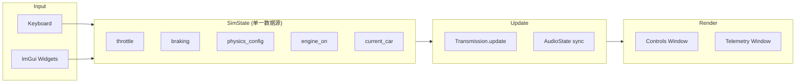

# Sim GUI 架构整改方案

## 当前问题分析

### 1. main.cpp 职责过重（God Object）
`app/sim_gui/main.cpp`（418行）同时负责：
- SDL 初始化/事件循环
- ImGui 渲染（两个窗口的全部 UI 代码）
- 物理更新（Transmission）
- 音频参数同步
- 键盘输入处理
- 状态管理（throttle, braking, engine_on, load_nm...）

**后果**：变量作用域混乱，GUI 代码和物理逻辑交织，修改一处容易引入 bug。

### 2. 物理参数设置时序冲突
```
physics update:  set_external_load(load_nm + 400)  // 刹车
GUI render:      set_external_load(load_nm)         // 覆盖刹车！
```
GUI 渲染在 physics update 之后执行，每帧都调用 setter 会覆盖之前的状态。

**根因**：没有明确的"输入 → 状态 → 渲染"单向数据流。

### 3. 状态散落在局部变量中
`throttle`, `braking`, `load_nm`, `engine_brake_nm`, `road_coeff` 等状态分散在 main 函数的局部变量里，GUI 和物理逻辑通过闭包式访问共享它们。

**后果**：无法独立测试 GUI 或物理逻辑。

### 4. 切车时参数丢失
`load_car()` 重新构造 `Transmission` 对象，之前通过 setter 设置的 `engine_brake`、`road_load_coeff` 全部丢失。

---

## 整改方案

### 目标架构



### 新文件结构

```
app/sim_gui/
├── main.cpp              # SDL init + event loop (< 80 lines)
├── sim_state.h           # SimState struct (all shared state)
├── sim_input.h/cpp       # Keyboard + GUI input → SimState
├── sim_physics.h/cpp     # SimState → Transmission.update → SimState
├── sim_gui.h/cpp         # SimState → ImGui rendering (read-only + widget callbacks)
├── sim_audio.h/cpp       # (existing) Audio callback
├── gui_gauges.h/cpp      # (existing) Custom gauge widgets
└── wav_loader.h/cpp      # (existing) WAV file loading
```

### SimState 设计

```cpp
struct PhysicsConfig {
    float load_nm = 200.0f;
    float engine_brake_nm = 60.0f;
    float road_coeff = 0.3f;
    float brake_force_nm = 400.0f; // Brake pedal force
};

struct SimState {
    // Input
    float throttle = 0.0f;
    bool braking = false;
    bool engine_on = false;

    // Physics config (GUI-adjustable, persists across car switch)
    PhysicsConfig physics;

    // Derived (read by GUI for display)
    float smoothed_rpm = 900.0f;
    float speed_kmh = 0.0f;
    uint8_t gear = 1;
    float load = 0.0f;
    bool rev_limiter = false;
    float afterfire = 0.0f;

    // Car management
    int current_car = 0;
    bool car_switch_requested = false;
    int car_switch_target = -1;
};
```

### 数据流（每帧）

```
1. sim_input_update(state, keys, dt)
   - 读键盘 → 更新 state.throttle, state.braking
   - GUI widget 回调 → 更新 state.physics.*

2. sim_physics_update(state, transmission, dt)
   - 应用 state.physics 到 transmission
   - 处理刹车：load = braking ? load_nm + brake_force : load_nm
   - transmission.update(throttle, dt)
   - 回写 state.smoothed_rpm, state.speed_kmh, etc.

3. sim_audio_sync(state, audio_state)
   - 把 state 的 rpm/throttle/load 同步到 audio callback

4. sim_gui_render(state)
   - 纯渲染，只读 state 显示数据
   - Widget 交互写回 state.physics.* 和 state.car_switch_*
```

### 关键原则

1. **单向数据流**：Input → State → Physics → Render
2. **GUI 不直接调用 Transmission setter** — 只修改 SimState
3. **Physics 统一应用所有参数** — 一个地方设置 external_load，不会被覆盖
4. **切车时保留 PhysicsConfig** — 只重建 Transmission，不丢失调参

### 实施步骤

| 步骤 | 内容 | 风险 |
|------|------|------|
| 1 | 创建 `sim_state.h`，定义 SimState | 低 |
| 2 | 抽取 `sim_physics.cpp`（~50行） | 低 |
| 3 | 抽取 `sim_gui.cpp`（~200行 ImGui 代码） | 中 |
| 4 | 抽取 `sim_input.cpp`（~30行键盘处理） | 低 |
| 5 | 重写 `main.cpp` 为胶水层（~80行） | 中 |
| 6 | 验证所有功能 + 跑测试 | 低 |

预计工作量：~1小时，不改变任何外部行为。
